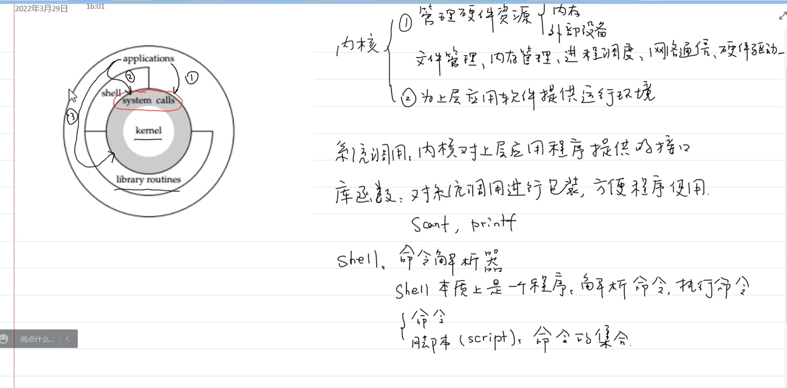
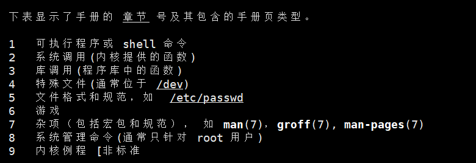
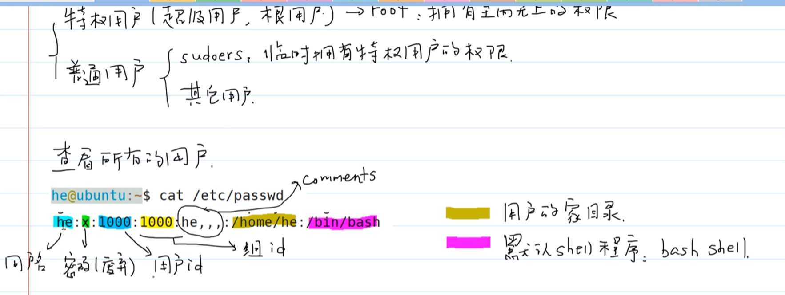
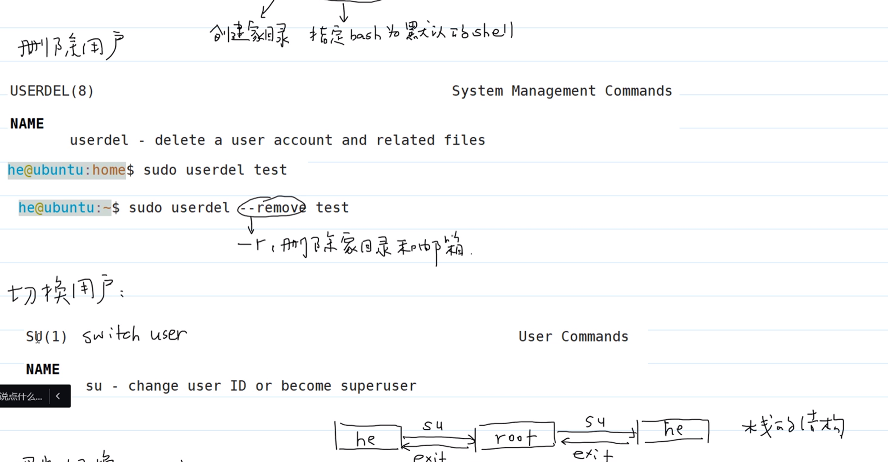
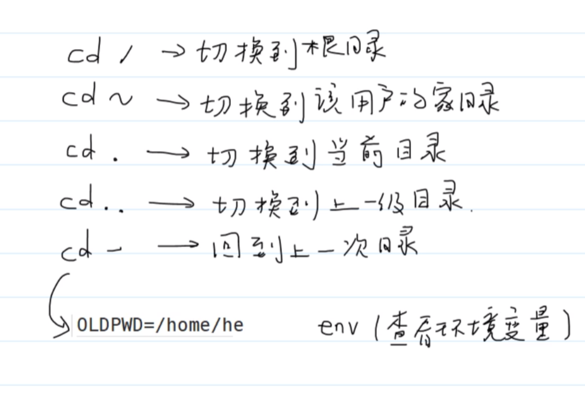
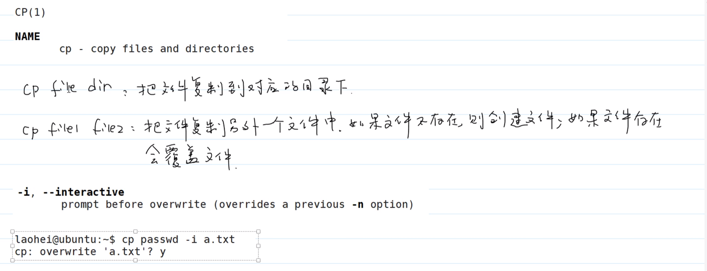
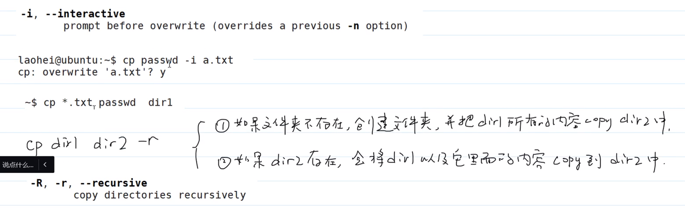
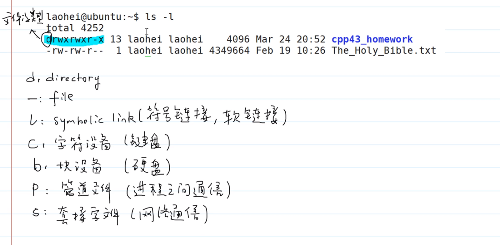
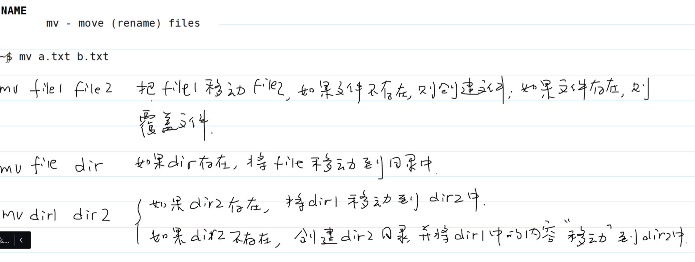

# Linux

## Linux系统结构

## 文件子系统

- man 手册的使用

- 文件常用操作

1. 如何创建删除用户？

> useradd创建新用户，userdel删除用户
>
> useradd  -m(home) -s(shell) /bin/bash test(用户名)
>
> usedel  -r test

2. 如何切换,退出用户

> su root
>
> su(switch user)
>
> exit(栈的形式退出)

3. 如何修改账户密码？

> passwd test

## 常用文件操作命令

- pwd

>print working directory
>
>显示shell这个进程当前工作目录

- cd

> change directory
>
> 改变当前工作目录
>
> cd ..(返回上一级目录)
>
> cd .(切换到当前目录)
>
> cd ~(返回home目录)
>
> cd -(返回上一次目录：不是栈)
>
> cd /(切换到根目录)

- ls

> 列举当前目录内容
>
> 相关参数
>
> - -a 显示所有内容包括隐藏内容
> - -h 以人类友好的方式显示
> - -l 详细显示文件相关信息

- 通配符

> *:匹配任意多个字符
>
> ？:匹配任意一个字符
>
> []: 匹配集合内任意一个字符
>
> [!]-匹配非集合内的任意一个字符
>
> [a-z]-类

- cp

> cp file dir(把文件复制到对应的目录中)
>
> cp file file2(把文件复制到另一个文件中，如果文件不存在，则创建file2)
>
> -i 提示相关操作
>
> cp dir1 dir2(如果文件夹2存在，则将文件夹1和文件夹1中所有内容复制到文件夹2；如果文件夹2不存在，则创建文件夹2，并将文件夹一中所有内容复制到文件夹2里)
>
> -u 只需要移动并不存在的文件

- mv

> mv file1 file2(如果文件2不存在相当于给文件1重命名，如果存在则覆盖文件2)
>
> mv  dir1 dir2(如果dir2存在，则将dir1剪切到dir2,如果不存在相当与重命名)

