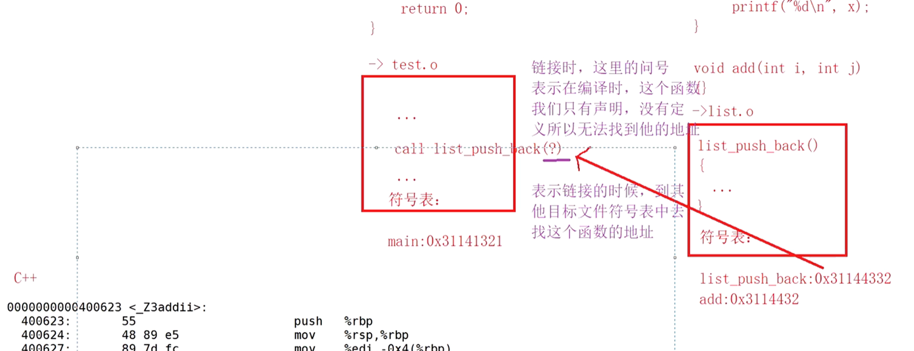
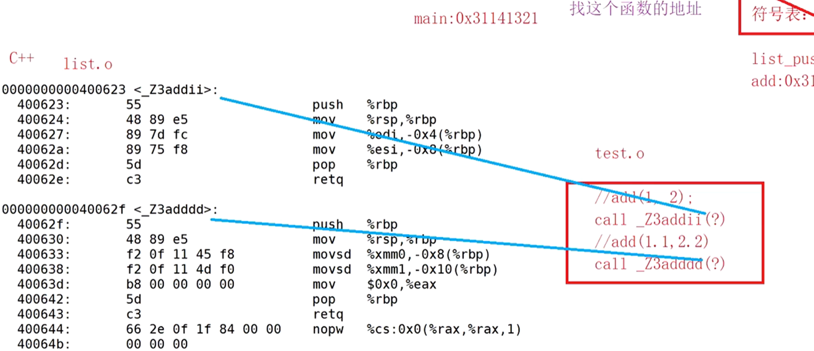
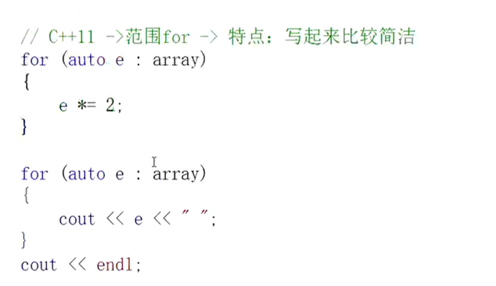

# CPP基础

## 1.命名空间

```c++
#include<iostream>
using namespace std;//练习使用，可能重复命名变量

using std::cout;
using std::cin;
using std::endl;
```

## 2.缺省函数

- 全缺省函数
- 半缺省函数

> 缺省函数就是对函数参数赋初值
>
> 半缺省函数只能从右开始连续缺省，调用函数时只能从左向右依次传参

## 3.函数重载

规定：函数名相同，参数不同（类型/个数/顺序）只是返回值不同，不能构成重载

> 为什么C语言不支持函数重载？C++可以 
>
> `list.h` `list.c` `test.c`
>
> 预处理->头文件展开/宏替换/条件编译/去掉注释
>
> `list.i` `test.i`
>
> 编译->检查语法，生成汇编代码
>
> `list.s` `test.s`
>
> 汇编->将汇编代码转成二进制的机器码
>
> `list.o` `test.o`
>
> 链接->将两个目标文件链接到一起
>
> c语言在链接的时候，符号表里的名称一样，会冲突。
>
> c++符号表里的名称会带参数 




## 4.extern"C"

](../Pictures/C++/3.png)

-  本来c程序不能识别C++程序（链接时，符号表名称不同）在C++程序前加上extern"C"可以使c语言识别，c++也可以识别。

## 5.引用&

)](../Pictures/C++/4.png)
](../Pictures/C++/5.png)

- 做参数（提高效率）
- 做返回值（提高效率）

## 6.范围for



将array中的数据依次给e；利用auto自动推其类型


