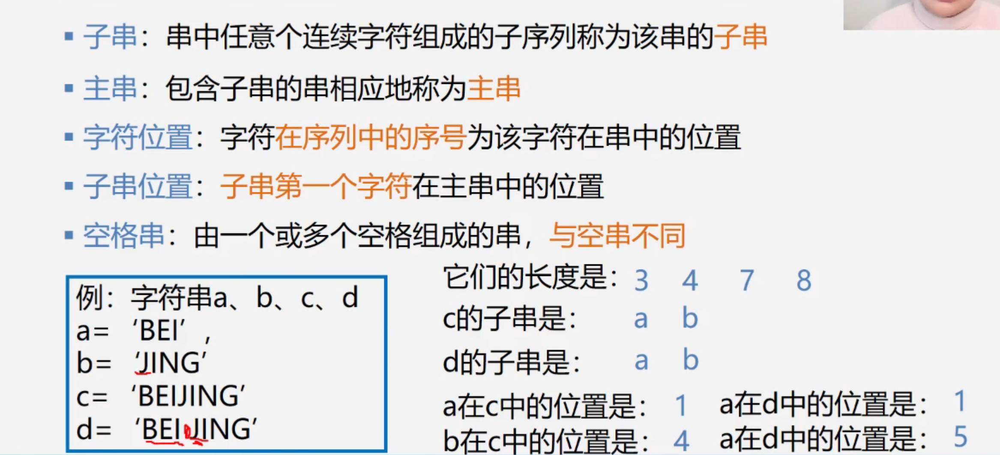
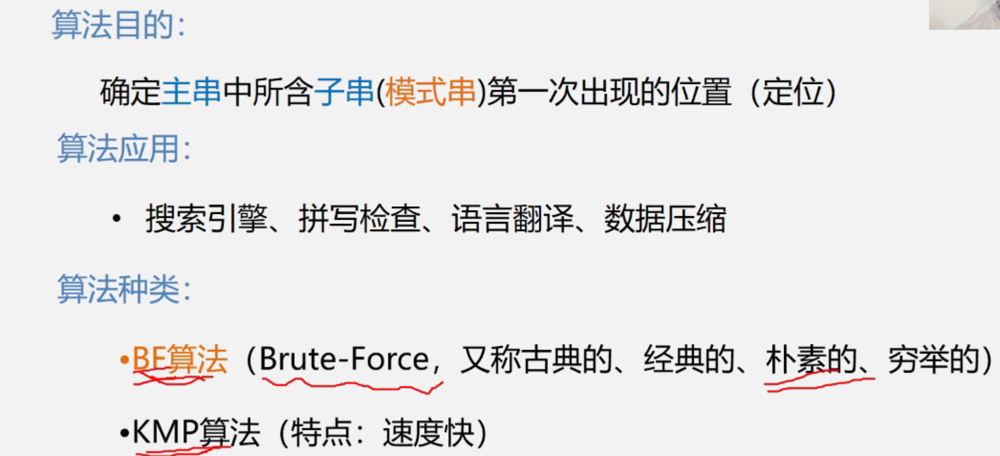
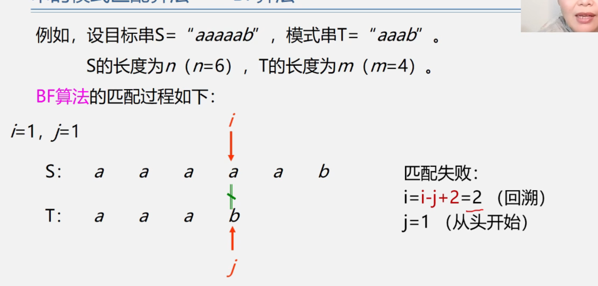
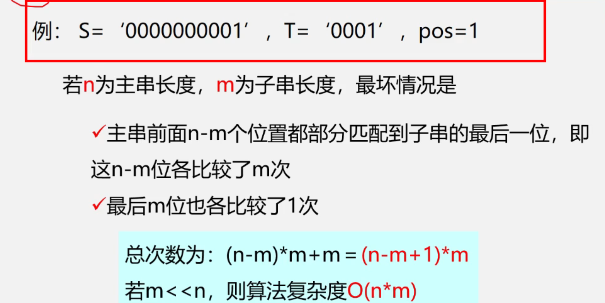
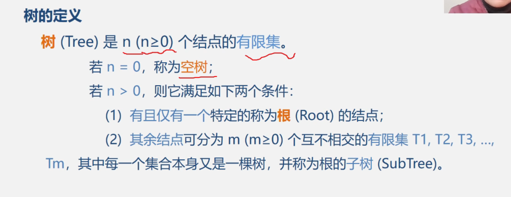
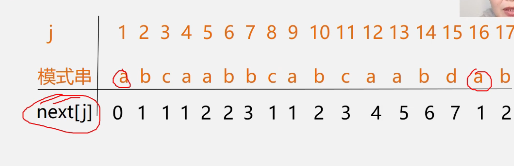
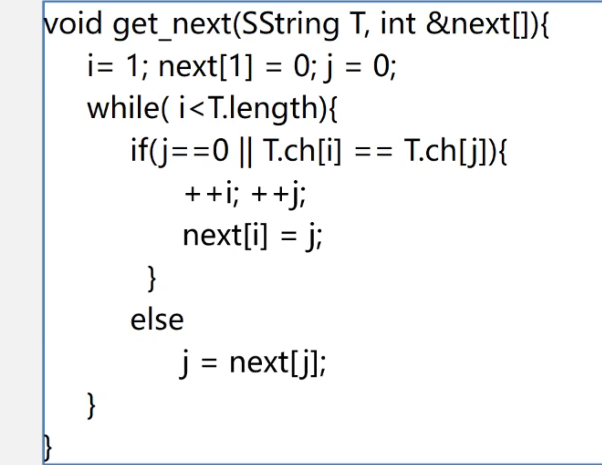
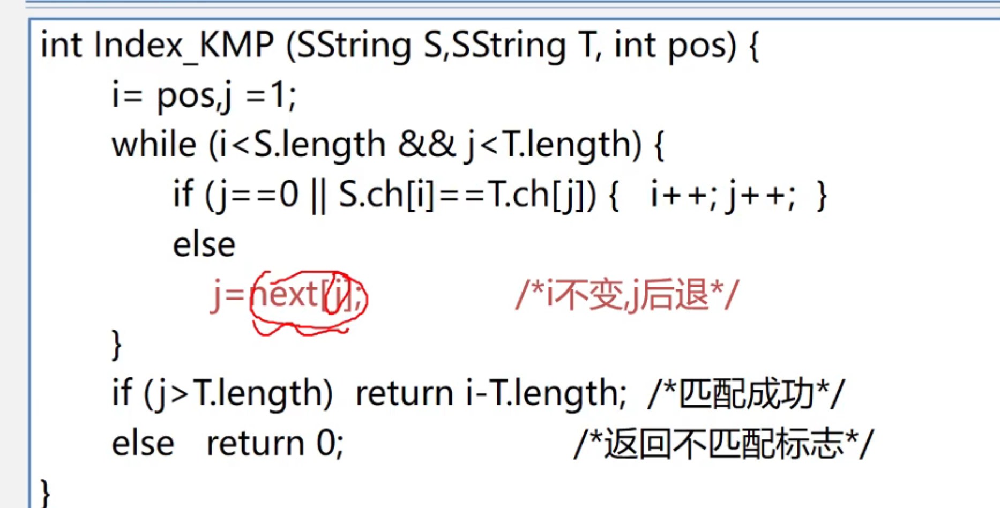

# String

## 字符串的相关定义

```c
typedef struct 
{
    char ch[MAXSIZE+1];
    int length;
}SString;


typedef struct Chnuk
{
    char ch[CHNUKSIZE];
    struct Chunk *next;
}Chunk;//块的大小

typedef struct 
{
Chunk *head,*tail;//串的头指针，尾指针
int curlen//串的当前长度
}LString;
```

## 匹配字符串

- 暴力破解

```c
int Index_BF(SString S,SString T)
{
    int i=1;
    int j=1;
   while(i<=S.length&&j<=T.length)
   {
    if(S.ch[i]==T.ch[j])
    {
        ++i;
        ++j;
    }
    else
    {
        i=i-j+2;//回溯，重新开始匹配
        j=1;
    }
    if(j>=T.length)
    {
        return i-T.length;

    }
    else
    {
        return 0;
    }
    

   }
}//时间复杂度O(n*m)
```

- KMP算法

```c
void Get_next(SString T,int next[])
{
    int i=1;
    int j=0;
    
    next[1]=0;
    while(i<T.length)
    {
        if(j==0||T.ch[i]==T.ch[j])
        {
            ++i;
            ++j;
            next[i]=j;
        }
        else
        {
            j=next[j];
        }

    }  
}

int Index_KMP(SString S,SString T)
{
    int i=1;
   int j=1;
    int next[T.length+1];
    Get_next(T,next);

   while(i<=S.length&&j<=T.length)
   {
    if(S.ch[i]==T.ch[j]||j==0)
    {
        ++i;
        ++j;
    }
    else
    {
        j=next[j];
    }
    if(j>T.length)
    {
        return i-T.length;
      

    }
    else
    {
        return 0;
    }
    

   }


}//不好理解

```

















