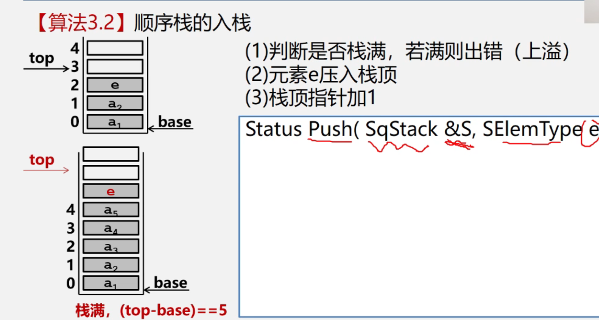
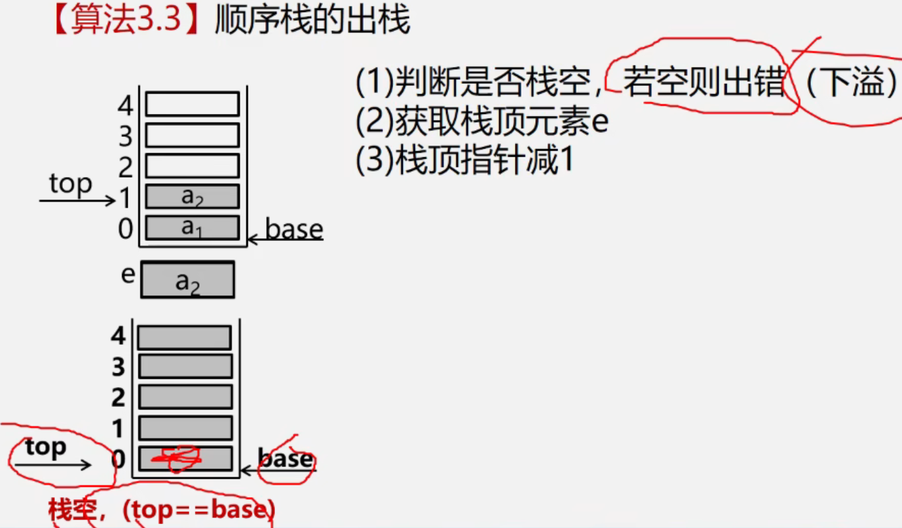
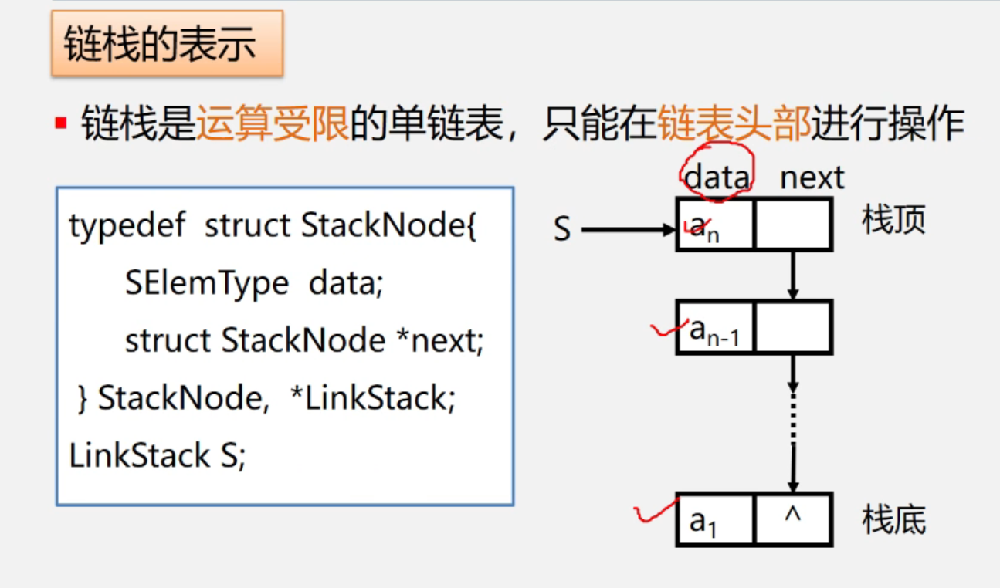
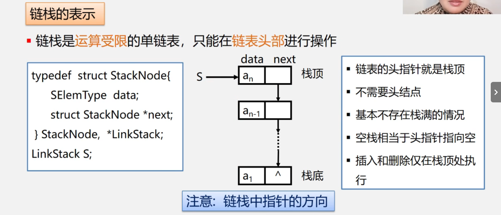
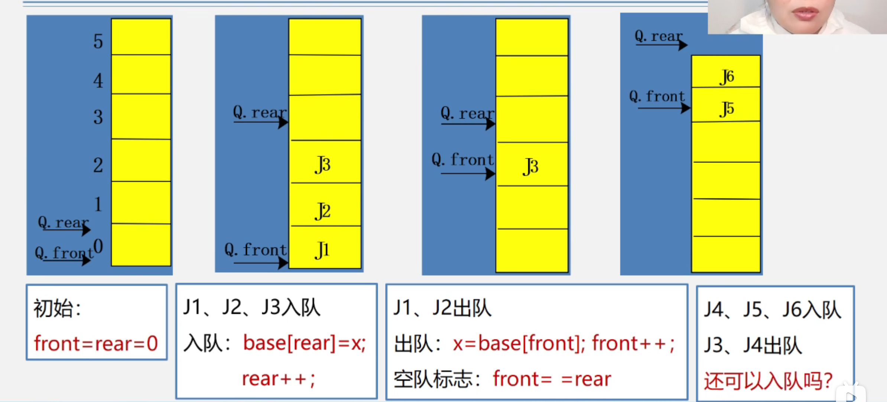
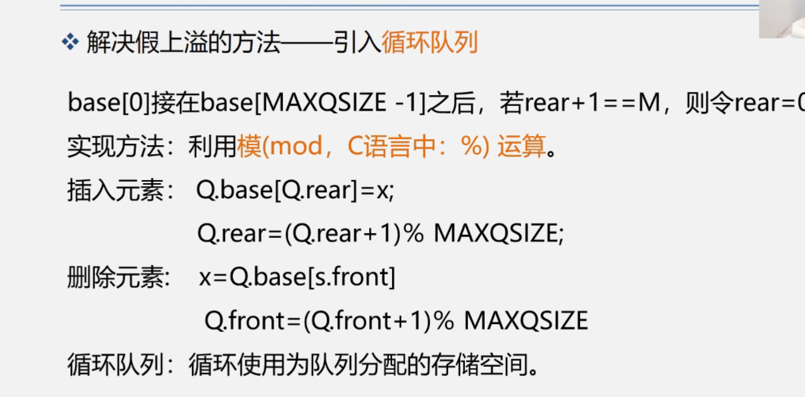
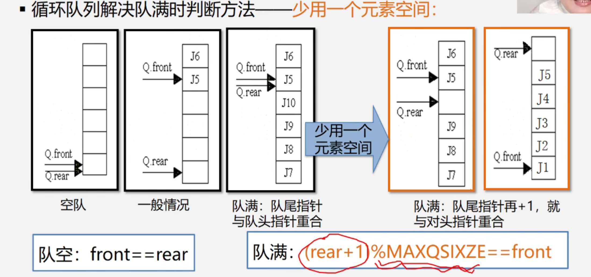
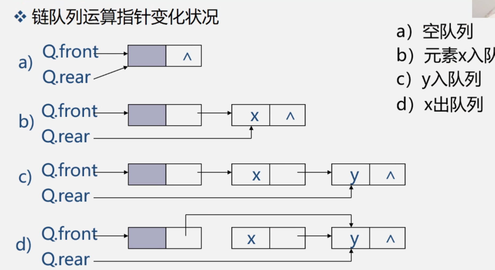

# 数据结构-栈与队列
## 栈
- 顺序栈的定义与相关操作

顺序栈的定义
```
typedef struct
{
    Elemtypedef *top;
    Elemtypedef *base;
    int size;
    
}sqstack;
```

顺序栈的初始化

```c
Status Init_Sqstack(sqstack *s)
{
    s->base=(Elemtypedef*)malloc(sizeof(Elemtypedef)*MAXSIZE);
    if(!s->base)
    return ERROR;
    s->top=s->base;
    s->size=MAXSIZE;
    return OK;

    
}
```

判断顺序栈是否为空

```c
Status IsStackEmpty(sqstack s)
{
    if(s.base==s.top)
    {
        return OK;
    }
    else
    {
        return ERROR;
    }
    
}
```

顺序栈的长度

```c
int  StackLength(sqstack s)
{
    return s.top-s.base;

}
```

*清空顺序栈*

```c
Status ClearStack(sqstack *s)
{
    if(s->base)
    {
        s->top=s->base;
    }
    return OK;
}
```

*销毁顺序栈*

```c
Status DestoryStack(sqstack *s)
{
    if(s->base)
    {
        free(s->base);
        s->size=0;
        s->base=s->top=NULL;
    }
    return OK;
}
```

*进栈*

```c
Status Push(sqstack *s, Elemtypedef e)
{
    if(s->top-s->base==s->size)
    {
        return OVERFLOW;
    }
    *s->top = e;
    s->top++;
    return OK;
}
```

*出栈*

```c
Status Pop(sqstack *s,Elemtypedef e)

{
    if(s->base==s->top)
    {
        return ERROR;
    }
    s->top--;
    e=*s->top;
    return OK;
}
```

*链栈的定义*

```c
typedef struct StackNode
{
    Elemtypedef data;
    struct StackNode *next;

}StackNode,*LinkStack;
```

*链栈的初始化*

```c
void Init_LinkStack(LinkStack s)
{
    s=NULL;
}
Status IsEmpty_LinkStack(LinkStack s)
{
    if(s==NULL)
    {
        return OK;
    }
    else
    {
        return ERROR;
    }
}
```

*链栈入栈*

```c
Status L_Push(LinkStack s,Elemtypedef e)
{
    LinkStack p=(LinkStack)malloc(sizeof(StackNode));
    p->data=e;
    p->next=s;
    s=p;
    return OK;
}
```

*链栈出栈*

```c
Status L_Pop(LinkStack s,Elemtypedef *e)
{
    if(s==NULL)
    return ERROR;
    LinkStack p;
    *e=s->data;
    p=s;
    s=s->next;
    free(p);
    return OK;

}
```










## 队列

- 顺序队列

顺序队列的定义

```c
typedef struct 
{
    Elemtypedef *base;
    int front;
    int rear;
}SqQueue;
```


顺序队列的初始化

```c
Status Init_SqQueue(SqQueue *Q)
{
    Q->base=(Elemtypedef*)malloc(sizeof(Elemtypedef)*MAXQSIZE);
    if(!Q->base)exit(OVERFLOW);
    Q->front=Q->rear=0;
    return OK;
}
```


顺序队列的入队

```c
Status Push_Q(SqQueue *Q,Elemtypedef e)
{
    if((Q->rear+1)%MAXQSIZE==Q->front)
   {
    return ERROR;
   }
    Q->base[Q->rear]=e;
    Q->rear=(Q->rear+1)%MAXQSIZE;
    return OK;
}
```


顺序队列的出队

```c
Status Pop_Q(SqQueue *Q,Elemtypedef *e)
{
    if(Q->front==Q->rear)
    {
        return ERROR;
    }
    *e=Q->base[Q->front];
    Q->front=(Q->front+1)%MAXQSIZE;
    return OK;
}

```


获取顺序队列长度

```c
int QueueLength(SqQueue Q)
{
    return (Q.rear-Q.front+MAXQSIZE)%MAXQSIZE;
}

```


判断队列是否为空

```c
Status QueueEmpty(SqQueue Q)
{
    return Q.front==Q.rear;
}
```


获取头元素

```c
Elemtypedef GetHead(SqQueue Q)
{
    if(Q.front!=Q.rear)
    return Q.base[Q.front];
}
```


- 链队

链队定义

```c
typedef struct Qnode
{
    Elemtypedef data;
    struct Qnode *next;
    
}Qnode,*QueuePtr;

typedef struct 
{
    QueuePtr front;
    QueuePtr rear;
}LinkQueue;
```


链队初始化

```c
Status Init_LQnode(LinkQueue *Q)
{
    Q->front=Q->rear=(QueuePtr)malloc(sizeof(Qnode));
    Q->front->next=NULL;
    return OK;
    
}

```


链队销毁

```c
Status DestoryLQueue(LinkQueue *Q)
{
    QueuePtr p;
    while(Q->front)
    {   
        p=Q->front->next;
        free(Q->front);
        Q->front=p;
       
    }
     return OK;
}//p换成Q->rear;
```


链队的入队

```c
Status PushLQueue(LinkQueue *Q,Elemtypedef e)
{
    QueuePtr p=(Qnode*)malloc(sizeof(Qnode));
    if(!p)exit(OVERFLOW);
    p->data=e;
    p->next=NULL;
    Q->rear->next=p;
    Q->rear=p;
    return OK;

}

```


链队的出队

```c
Status PopLQueue(LinkQueue *Q,Elemtypedef *e)
{
    if(Q->front==Q->rear)
    {
        return ERROR;
    }
    QueuePtr p=Q->front->next;
    *e=p->data;
    Q->front=p->next;
    if(Q->rear==p)
    Q->rear=Q->front;

    free(p);
    
}
```


获取首元结点元素

```c
Status GetQnodeHead(LinkQueue Q,Elemtypedef *e)
{
    if(Q.front=Q.rear)
    {
        return ERROR;
    }
    *e=Q.front->next->data;
    return OK;
}
```










